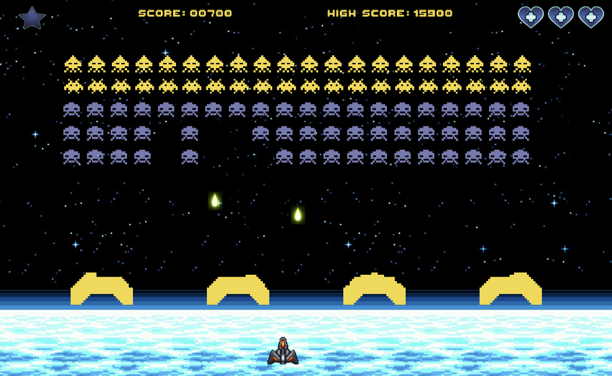
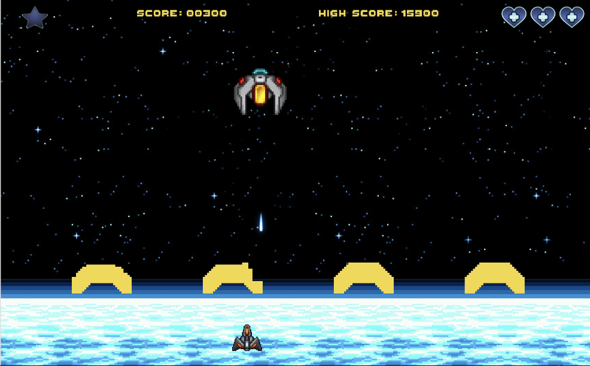

# Galactic Defenders




## About
Galactic Defenders is a space shooter game developed in C++. Players navigate a spaceship to defend against waves of alien invaders. The game includes multiple levels, each with increasing difficulty and unique challenges.

## Features
- **Multiple Levels**: Different stages with varied enemy waves.
- **Dynamic Gameplay**: Fast-paced action with increasing difficulty.
- **Graphics and Sound**: Engaging visuals and audio effects.

## Installation
To install and run the game, follow these steps:

### Clone the repository:
```bash
git clone https://github.com/clerisyutsav47/Galactic-Defenders.git
cd Galactic-Defenders
```

### Install CMake:
- **Ubuntu/Debian**:
    ```bash
    sudo apt-get update
    sudo apt-get install -y cmake
    ```
- **Windows**:
    Download and install CMake from the [official website](https://cmake.org/download/).

### Install Raylib:
- **Ubuntu/Debian**:
    ```bash
    sudo apt-get install -y build-essential libgl1-mesa-dev
    sudo apt-get install -y raylib libraylib-dev
    ```
- **Windows**:
    Follow the instructions on the [Raylib GitHub page](https://github.com/raysan5/raylib#desktop).

### Build the project:
```bash
mkdir build
cd build
cmake ..
make
```

### Run the game:
```bash
./GalacticDefenders
```

## Requirements
- C++ Compiler (GCC, Clang, etc.)
- CMake 3.10+
- Raylib library

## How to Play
- Use arrow keys to navigate the spaceship.
- Press the spacebar to shoot.
- Destroy all aliens to advance to the next level.

## Contributing
Contributions are welcome! Please fork the repository and create a pull request for any enhancements or bug fixes.

## License
This project is licensed under the GPL-3.0 License.
